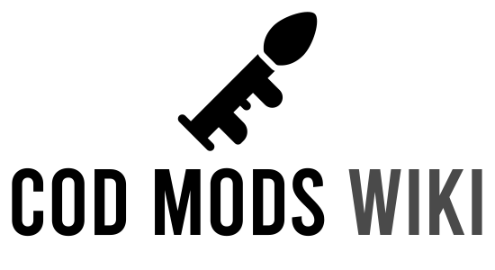

<h1 align="center">Welcome to the CoD Mods Wiki</h1>

Welcome to the main repository for the CoD Mods Wiki. Our goal with this site is to provide a wiki dedicated to technical and general information on modding Call of Duty. We generally focus primarily on Call of Duty: Black Ops III but are welcome to anyone to submit info for other Call of Duty titles, including those without official SDKs.

**This wiki is not affiliated with Activision or the developers, we are modders who want to help out other modders with working with Call of Duty.**

# Contributing

Our goal is to build this wiki up with as much information as possible, and your help is highly appreciated.

To contribute documentation first you'll need to fork the repo, if that sounds new to you then Github has a great page on it [here](https://docs.github.com/en/get-started/quickstart/fork-a-repo), it simply means you make a copy of our repo and from that you can make your own edits without affecting our repo.

Next you can view existing documents in the `_docs` folder for an idea of how to structure your tutorials and get an idea of how to lay it out, try and keep it professional but we're not looking for top quality, if we feel it's missing something we will fix it up. 

Next you'll need to edit the `toc.yml` file and add your document to it so it shows up in the sidebar. 

If you want to get an idea of what features you can use such as alerts check out the official [Docsy](https://github.com/vsoch/docsy-jekyll) repo.

Finally, you can file a pull request by going to the Pull requests tab which allows you to submit your changes, unless you break our guidelines or your contribution is a duplicate, we will more than likely take it on board!

We may split up your contribution if we feel it's too large, or we may marge it with existing documentation, but once your PR is submitted, we'll do the rest.

If you're finding it hard to follow all this but still want to contribute then you can open an issue or post in the Discord with your documentation, images, and assets and we'll handle the rest, but contributions made this way may take longer for us to add to the repo as time is limited.

# Credits

The CoD Mods Logo is from [Andrejs Kirma](https://thenounproject.com/andrejs/) on the Noun Project, you can view it [here](https://thenounproject.com/icon/rpg-2526449/). 

The main wiki is powered by the beautiful [Docsy for Jekyll](https://github.com/vsoch/docsy-jekyll) by [Vanessasaurus](https://github.com/vsoch).